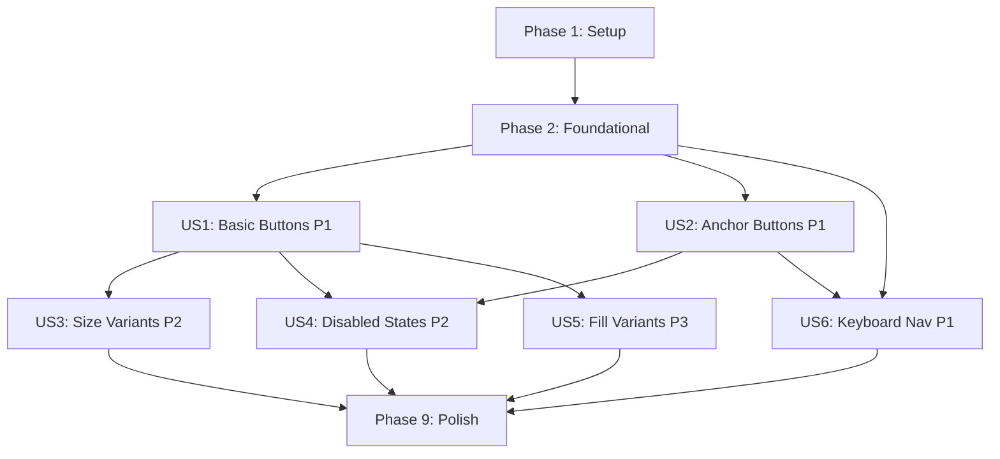

# Implementation Tasks: Accessible Button Component

**Feature**: Accessible Button Component  
**Branch**: `feat/button`  
**Created**: 2026-01-06  
**Status**: Validation & Documentation Phase

**Note**: The Button component is already implemented and production-ready. These tasks focus on validation, testing verification, and documentation completeness to ensure all requirements from the specification are met.

---

## Task Summary

- **Total Tasks**: 47
- **Setup Phase**: 3 tasks (foundation prerequisites)
- **Foundational Phase**: 8 tasks (shared infrastructure validation)
- **User Story 1 (P1)**: 6 tasks (Basic Button Usage)
- **User Story 2 (P1)**: 6 tasks (Anchor Buttons)
- **User Story 3 (P2)**: 5 tasks (Size Variants)
- **User Story 4 (P2)**: 7 tasks (Disabled States)
- **User Story 5 (P3)**: 4 tasks (Fill Style Variants)
- **User Story 6 (P1)**: 5 tasks (Keyboard Navigation)
- **Polish Phase**: 3 tasks (final validation)

**Parallel Opportunities**: 26 tasks marked with [P] can be executed independently.

**MVP Scope**: User Story 1 (Basic Button Usage) provides the minimum viable product.

---

## Implementation Strategy

### Incremental Delivery Approach

1. **Phase 1: Setup** - Validate repository structure and Foundation CSS configuration
2. **Phase 2: Foundational** - Verify shared infrastructure (style loader, type exports)
3. **Phases 3-8: User Stories** - Each phase validates one complete, independently testable user story
4. **Phase 9: Polish** - Cross-cutting concerns and final documentation

### Independent Testing Per Story

Each user story phase includes:
- Storybook interaction test validation (primary testing method)
- Accessibility verification (AXE checks)
- Manual test scenarios documented
- Edge case coverage confirmed

### Constraints Enforcement

- **NO** `.dropdown` or `.arrow-only` variants (dropdown-specific, out of scope)
- **MUST** ship CSS with `$button-responsive-expanded: true` (responsive classes enabled)
- **PREFER** Storybook interaction tests over unit tests (constitution mandate)
- **ENFORCE** a11y semantics: `<a href>` stays link, only no-href anchors use `role="button"`

---

## Phase 1: Setup (Foundation Prerequisites)

**Goal**: Validate repository structure and Foundation CSS configuration are ready for button component.

**Completion Criteria**: 
- Foundation 6.9.0+ installed and configured
- Sass compilation includes button styles with responsive-expanded enabled
- Pre-compiled CSS available at expected runtime path

### Tasks

- [ ] T001 Verify Foundation for Sites 6.9.0+ is installed in packages/ngx-foundation-sites/package.json
- [ ] T002 [P] Confirm `$button-responsive-expanded: true` in Sass configuration files under packages/ngx-foundation-sites/src/lib/scss/
- [ ] T003 [P] Validate pre-compiled button CSS exists at packages/ngx-foundation-sites/dist-css/nfs-button.css with responsive classes

---

## Phase 2: Foundational (Shared Infrastructure)

**Goal**: Verify all shared infrastructure components needed by button are present and functional.

**Completion Criteria**:
- NfsStyleLoader service exists and implements reference counting
- Button type exports are available from public API
- Component file structure follows Nx conventions
- Storybook is configured for button stories

### Tasks

- [ ] T004 Verify NfsStyleLoader service exists at packages/ngx-foundation-sites/src/lib/core/nfs-style-loader.service.ts with load/unload methods
- [ ] T005 [P] Validate button component exists at packages/ngx-foundation-sites/src/lib/button/button.ts with attribute selector
- [ ] T006 [P] Verify button type exports (NfsButtonSize, NfsButtonColor, NfsButtonFill, NfsButtonExpanded, NfsButtonExpandedBreakpoint) are exported from packages/ngx-foundation-sites/src/lib/button/index.ts
- [ ] T007 [P] Confirm button barrel export in packages/ngx-foundation-sites/src/lib/index.ts includes NfsButton component
- [ ] T008 [P] Validate Storybook stories file exists at packages/ngx-foundation-sites/src/lib/button/button.stories.ts
- [ ] T009 [P] Verify Storybook is runnable with `npm run storybook` and button stories are visible
- [ ] T010 Run Storybook interaction tests for button with `nx test-storybook ngx-foundation-sites` to establish baseline
- [ ] T011 Document baseline test results in specs/feat/button/VALIDATION_RESULTS.md

---

## Phase 3: User Story 1 - Basic Button Usage (P1)

**User Story**: Developers need to create standard interactive buttons (submit, cancel, actions) with minimal markup that follow Foundation's visual design system.

**Independent Test Criteria**:
- Can render `<button nfsButton>Text</button>` with Foundation `.button` class applied
- Foundation CSS classes are visible in DOM
- Click events fire correctly
- Default color (primary) is applied without explicit `color` input

**Test Approach**: Storybook interaction tests + manual verification in browser DevTools.

### Tasks

- [ ] T012 [P] [US1] Verify Default story in button.stories.ts tests Foundation `.button` and `.primary` classes are applied
- [ ] T013 [P] [US1] Validate ColorVariants story renders all 5 color variants (primary, secondary, success, alert, warning) correctly
- [ ] T014 [P] [US1] Add Storybook interaction test to ColorVariants story to verify each button has correct color class
- [ ] T015 [US1] Test click event handler fires correctly by adding test to Default story with userEvent.click
- [ ] T016 [US1] Verify ChangeDetectionStrategy.OnPush is set in button component metadata
- [ ] T017 [US1] Document User Story 1 test results in specs/feat/button/VALIDATION_RESULTS.md with screenshots

---

## Phase 4: User Story 2 - Anchor Buttons (P1)

**User Story**: Developers need to use native `<a>` elements styled as Foundation buttons with correct semantics.

**Independent Test Criteria**:
- `<a nfsButton href="/path">` does NOT have `role="button"` (preserves link semantics)
- `<a nfsButton>` without `href` HAS `role="button"` and `tabindex="0"`
- Anchor without `href` responds to Space key activation
- Soft-disabled anchors have `tabindex="-1"`

**Test Approach**: Storybook interaction tests for role/tabindex verification + keyboard interaction tests.

### Tasks

- [ ] T018 [P] [US2] Create AnchorWithHref story in button.stories.ts rendering `<a nfsButton href="/test">Link</a>`
- [ ] T019 [P] [US2] Add interaction test to AnchorWithHref story verifying NO `role="button"` attribute (preserves link semantics)
- [ ] T020 [P] [US2] Create AnchorWithoutHref story rendering `<a nfsButton>Button</a>` (no href)
- [ ] T021 [P] [US2] Add interaction test to AnchorWithoutHref story verifying `role="button"` and `tabindex="0"` are present
- [ ] T022 [US2] Add keyboard interaction test to AnchorWithoutHref story verifying Space key activates the anchor
- [ ] T023 [US2] Document User Story 2 test results in specs/feat/button/VALIDATION_RESULTS.md

---

## Phase 5: User Story 3 - Size Variants (P2)

**User Story**: Developers need to create buttons in different sizes (tiny, small, default, large, expanded) to match UI hierarchy and responsive design needs.

**Independent Test Criteria**:
- `size="tiny"` applies `.tiny` class
- `size="small"` applies `.small` class
- `size="default"` applies NO size class (Foundation default)
- `size="large"` applies `.large` class
- `expanded="true"` applies `.expanded` class
- `expanded="medium"` applies `.medium-expanded` class

**Test Approach**: Storybook interaction tests for CSS class verification.

### Tasks

- [ ] T024 [P] [US3] Verify SizeVariants story exists in button.stories.ts rendering all 4 size variants
- [ ] T025 [P] [US3] Add interaction test to SizeVariants story verifying `.tiny`, `.small`, `.large` classes are applied correctly
- [ ] T026 [P] [US3] Create ExpandedVariants story rendering boolean expanded and all 7 responsive breakpoint variants
- [ ] T027 [P] [US3] Add interaction test to ExpandedVariants story verifying `.expanded` class for boolean true
- [ ] T028 [US3] Add interaction test to ExpandedVariants story verifying responsive classes (`.medium-expanded`, `.small-only-expanded`, etc.)

---

## Phase 6: User Story 4 - Disabled States (P2)

**User Story**: Developers need both hard-disabled (not focusable) and soft-disabled ("aria-disabled") buttons to support different UX patterns like showing tooltips on disabled buttons.

**Independent Test Criteria**:
- Native `disabled` attribute makes button not focusable (Tab skips it)
- `[softDisabled]="true"` on `<button>` keeps button focusable with `aria-disabled="true"`
- `[softDisabled]="true"` on `<button>` prevents click events (capture-phase prevention)
- `[softDisabled]="true"` on `<a>` sets `aria-disabled="true"` and `tabindex="-1"` (removes from tab order)
- `.disabled` CSS class is applied when soft-disabled

**Test Approach**: Storybook interaction tests for focus behavior + click prevention + ARIA attributes.

### Tasks

- [ ] T029 [P] [US4] Create HardDisabled story rendering `<button nfsButton disabled>Disabled</button>`
- [ ] T030 [P] [US4] Add interaction test to HardDisabled story verifying button is not in tab order (not focusable)
- [ ] T031 [P] [US4] Create SoftDisabled story rendering `<button nfsButton [softDisabled]="true">Soft Disabled</button>`
- [ ] T032 [P] [US4] Add interaction test to SoftDisabled story verifying button has `aria-disabled="true"` and remains focusable
- [ ] T033 [P] [US4] Add interaction test to SoftDisabled story verifying click event is prevented
- [ ] T034 [P] [US4] Create SoftDisabledAnchor story rendering `<a nfsButton [softDisabled]="true">Disabled Link</a>`
- [ ] T035 [US4] Add interaction test to SoftDisabledAnchor story verifying `aria-disabled="true"` and `tabindex="-1"` are set

---

## Phase 7: User Story 5 - Fill Style Variants (P3)

**User Story**: Developers need hollow (outline) and clear (text-only) button styles to create visual hierarchy and secondary actions.

**Independent Test Criteria**:
- `fill="solid"` applies NO fill class (Foundation default)
- `fill="hollow"` applies `.hollow` class
- `fill="clear"` applies `.clear` class
- Fill variants work with all color variants

**Test Approach**: Storybook interaction tests for CSS class verification.

### Tasks

- [ ] T036 [P] [US5] Verify FillVariants story exists in button.stories.ts rendering solid, hollow, and clear variants
- [ ] T037 [P] [US5] Add interaction test to FillVariants story verifying `.hollow` class is applied for hollow buttons
- [ ] T038 [P] [US5] Add interaction test to FillVariants story verifying `.clear` class is applied for clear buttons
- [ ] T039 [US5] Create CombinedVariants story showing all combinations of size, color, and fill to verify no conflicts

---

## Phase 8: User Story 6 - Keyboard Navigation (P1)

**User Story**: Users navigating with keyboard need to access all buttons, activate them with Enter/Space, and receive proper focus indicators.

**Independent Test Criteria**:
- Tab key moves focus between buttons in DOM order
- Enter key activates focused `<button>` elements
- Space key activates focused `<button>` elements
- Space key activates focused `<a>` elements without `href`
- Focus indicators are visible (Foundation's `:focus` styles)

**Test Approach**: Storybook interaction tests for keyboard activation.

### Tasks

- [ ] T040 [P] [US6] Create KeyboardNavigation story rendering multiple buttons in sequence
- [ ] T041 [P] [US6] Add interaction test to KeyboardNavigation story verifying Tab key moves focus between buttons
- [ ] T042 [P] [US6] Add interaction test to KeyboardNavigation story verifying Enter key activates focused button
- [ ] T043 [P] [US6] Add interaction test to KeyboardNavigation story verifying Space key activates focused button
- [ ] T044 [US6] Add interaction test verifying Space key activates anchor button (no href) correctly

---

## Phase 9: Polish & Cross-Cutting Concerns

**Goal**: Final validation of accessibility, documentation completeness, and overall quality.

**Completion Criteria**:
- All Storybook interaction tests pass with 0 failures
- AXE accessibility checks pass with 0 violations
- All requirements from spec.md are validated
- Documentation is complete and accurate

### Tasks

- [ ] T045 Run full Storybook interaction test suite with `nx test-storybook ngx-foundation-sites` and verify 100% pass rate
- [ ] T046 Validate all AXE accessibility checks pass in Storybook (check for violations in test output)
- [ ] T047 Update specs/feat/button/VALIDATION_RESULTS.md with final results, pass/fail status for all requirements, and any gaps identified

---

## Dependency Graph (User Story Completion Order)



**Critical Path**: Setup → Foundational → US1 → US3 → Polish

**Parallel Tracks**:
- After Foundational: US1, US2, US6 can all be validated in parallel
- After US1: US3, US4, US5 can be validated in parallel (though US4 depends on US2 for anchor-specific tests)

---

## Parallel Execution Examples

### After Phase 2 (Foundational)

**Team Member A**:
- T012-T017 (User Story 1: Basic Button Usage)

**Team Member B**:
- T018-T023 (User Story 2: Anchor Buttons)

**Team Member C**:
- T040-T044 (User Story 6: Keyboard Navigation)

### After User Story 1 Complete

**Team Member A**:
- T024-T028 (User Story 3: Size Variants)

**Team Member B**:
- T029-T035 (User Story 4: Disabled States)

**Team Member C**:
- T036-T039 (User Story 5: Fill Variants)

---

## Success Criteria Validation Checklist

### From spec.md Success Criteria

- [ ] **SC-001**: 1-line markup validated - `<button nfsButton>Text</button>` renders correctly
- [ ] **SC-002**: 100% AXE accessibility checks pass in Storybook interaction tests
- [ ] **SC-003**: Keyboard navigation (Tab/Enter/Space) works for all buttons
- [ ] **SC-004**: Soft-disabled `<button>` elements remain focusable with `aria-disabled`
- [ ] **SC-005**: Anchor buttons respond to Space key activation correctly
- [ ] **SC-006**: All Foundation button CSS classes applied correctly based on inputs
- [ ] **SC-007**: Responsive expanded classes applied at correct breakpoints
- [ ] **SC-008**: Component bundle size <2KB gzipped (no Foundation JavaScript)
- [ ] **SC-009**: Component works in CSR and SSR contexts (SSR validated via afterNextRender usage)
- [ ] **SC-010**: Dynamic input changes trigger reactive updates (signal-based inputs)

### From plan.md Constitution Check

- [ ] Component uses Angular APIs only (no Foundation JS)
- [ ] Component names align with Foundation conventions (`NfsButton` → `.button`)
- [ ] Injection tokens follow `Token` suffix (N/A for button)
- [ ] Component passes AXE checks (verified via Storybook)
- [ ] WCAG AA standards met (focus, contrast, ARIA)
- [ ] Foundation CSS classes applied correctly
- [ ] No custom CSS (pure Foundation styles)
- [ ] Standalone component (no NgModules)
- [ ] Signals for state management
- [ ] `input()` functions instead of decorators
- [ ] `ChangeDetectionStrategy.OnPush` set
- [ ] Member visibility follows guidelines
- [ ] Storybook interaction tests implemented

---

## Edge Cases Validation

These edge cases should be verified during task execution:

1. **Both `disabled` and `softDisabled` set** → Native `disabled` takes precedence (T030, T032)
2. **`softDisabled` changes dynamically** → Click listener added/removed reactively (T033)
3. **Anchor with `softDisabled="true"` but no `href`** → `aria-disabled` and `tabindex="-1"` applied (T035)
4. **Invalid `expanded` breakpoint string** → Treated as boolean (booleanAttribute fallback) - add to T028
5. **Multiple color classes change dynamically** → Signal reactivity handles correctly (T013, T014)
6. **Icon-only button without `aria-label`** → Developer responsibility (document in T047)
7. **Space key on native `<button>`** → Native behavior (no handler needed) - verify in T043
8. **Empty `href=""` attribute** → Treated as link (has href attribute) - add to T019

---

## Verification Commands

### Run Storybook Locally
```bash
npm run storybook
# Opens at http://localhost:4400
# Navigate to Controls/Button to see all stories
```

### Run Storybook Interaction Tests
```bash
nx test-storybook ngx-foundation-sites
# Runs all interaction tests in headless mode
# Reports pass/fail for each story's play function
```

### Run E2E Tests (CSS Validation)
```bash
nx e2e ngx-foundation-sites-e2e
# Validates responsive-expanded CSS classes in consumer app context
```

### Build Library
```bash
nx build ngx-foundation-sites
# Outputs to dist/packages/ngx-foundation-sites
# Check bundle size with: du -sh dist/packages/ngx-foundation-sites
```

### Full CI Pipeline
```bash
npm run ci
# Runs all checks: lint, type-check, tests, build
```

---

## Implementation Notes

### Test File Locations

- **Primary**: `packages/ngx-foundation-sites/src/lib/button/button.stories.ts`
- **Validation Results**: `specs/feat/button/VALIDATION_RESULTS.md` (to be created)
- **E2E**: `packages/ngx-foundation-sites-e2e/src/button.spec.ts` (if exists)

### Storybook Interaction Test Pattern

```typescript
export const StoryName: Story = {
  render: () => ({
    template: `<button nfsButton>Test</button>`,
  }),
  play: async ({ canvasElement }) => {
    const canvas = within(canvasElement);
    const button = canvas.getByRole('button', { name: /Test/i });
    
    // Verify CSS classes
    expect(button).toHaveClass('button', 'primary');
    
    // Verify click works
    await userEvent.click(button);
    
    // Verify ARIA attributes
    expect(button).toHaveAttribute('aria-disabled', 'true');
  },
};
```

### AXE Accessibility Check Pattern

Storybook automatically runs AXE checks if configured. Verify in test output:

```bash
nx test-storybook ngx-foundation-sites
# Look for: "Accessibility violations: 0"
```

### Documentation Templates

Create `specs/feat/button/VALIDATION_RESULTS.md` with structure:

```markdown
# Button Component Validation Results

## Test Execution Date
[Date]

## Phase Results

### User Story 1: Basic Button Usage
- [x] T012: Default story verified
- [ ] T013: ColorVariants story verified
...

## Requirements Coverage
- [x] FR-001: Foundation `.button` class applied
...

## Known Issues
[None / List any gaps]
```

---

## Final Notes

- **Implementation Status**: Button component is already implemented (button.ts exists)
- **Task Focus**: Validation and testing verification, NOT new implementation
- **Acceptance**: All tasks marked complete + all success criteria validated = feature complete
- **Next Steps After Completion**: Update CHANGELOG, publish library release

**Ready for `/speckit.implement` execution.**
